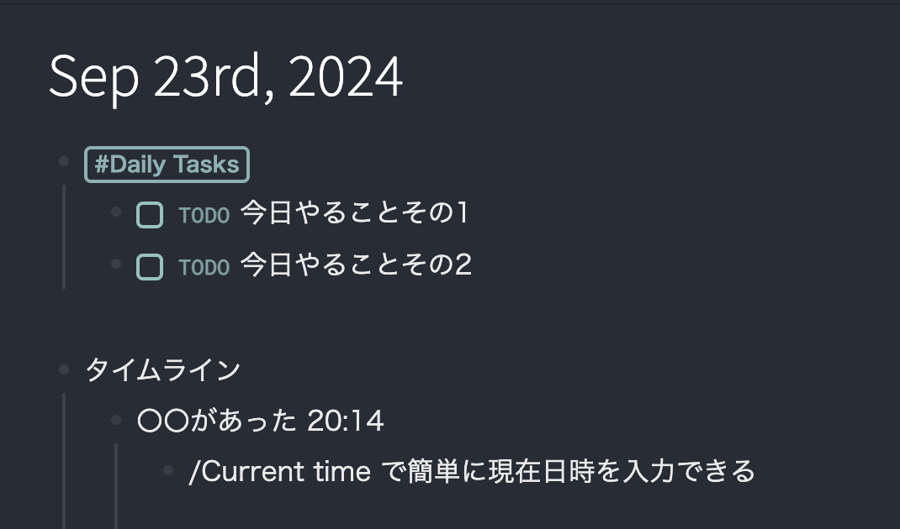
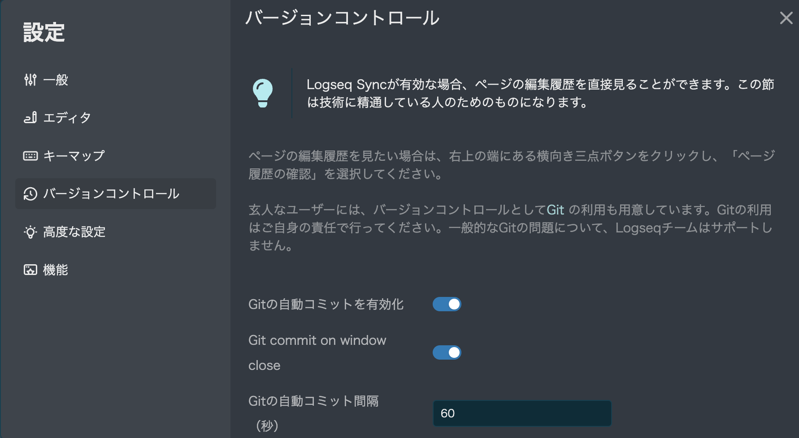

## そもそもLogseqとは
いわゆるPKM(Personal Knowledge Management)ツールです。アウトライナーとして思考の整理もできますし、TODO管理にも使えます。

私が特に気に入っている機能としては、日誌機能です。日誌を書くことで、その日に何をしたかを記録することができます。これにより、日々の進捗を可視化することができます。
また、ハッシュタグ機能もあります。これにより、タグをつけることで、関連する事項をまとめることができます。 

そのため、私の場合は日々作業の開始前に、その日のTODOを書き出し、その日の進捗を記録するようにしています。




これらは内部的にはすべてMarkdownで書かれているので、Gitで簡単にバージョン管理することもできます。

Markdownの何がありがたいかって、AI周りに強いんです。ワード、ドキュメントやデフォルトのメモアプリと違って、Markdownはテキストファイルなので、AIが読み取りやすいんです。MDファイルであればGIthub Copilotの参照元にもなりますし、最近のAI活用の流れにも乗れるというわけです。

## Logseqのgit同期
LogseはMac,Windows版ではデフォルトでGitとの同期ができるようになっています。

https://hub.logseq.com/integrations/aV9AgETypcPcf8avYcHXQT/logseq-sync-with-git-and-github/krMyU6jSEN8jG2Yjvifu9i


グラフの保存場所をgit管理下に置き、設定を行うことで、LogseqのデータをGitで管理することができます。


デフォルトでは自動commitのみの対応ですが、Giiのフックを使うことで、自動pushも可能です。post-commitフックにpushを追加することで、commit時に自動でpushすることができます。

ですがこのプラグインを入れることで、ショートカットからコミットやプッシュを行うことができます。プラグインを使うことに投稿がなければ、こちらのほうが便利です。

https://github.com/haydenull/logseq-plugin-git

## AndroidでのLogseqの使い方
Android版は[公式サイト](https://logseq.com/)からAPKをダウンロードしてインストールすることで使うことができます。
そのままではファイルのクラウド同期系サービスを使うことが推奨されますが、私はGitを使いたかったので、Termuxを使ってGitを使うことにしました。

### Termuxのインストール
[Google Play](https://play.google.com/store/apps/details?id=com.termux)からインストールできます。

```bash
termux-setup-storage
```
上記のコマンドを実行することで、Androidのストレージにアクセスできるようになります。
すべてのファイルへのアクセス権限がないと、Logseqアプリで作成したファイルにアクセスできないので、必ず実行してください。

```bash
pkg install git
```
上記でGitをインストールすると、そのままssh接続用の鍵も作成されます。
```bash
Generating public/private rsa key pair.

Your identification has been saved in /data/data/com.termux/files/usr/etc/ssh/ssh_host_rsa_key

Your public key has been saved in /data/data/com.termux/files/usr/etc/ssh/ssh_host_rsa_key.pub
```

あとはそのssh_host_rsa_key.pubをGitHubに登録することで、ssh接続ができるようになります。

私はわかりやすくDocumentフォルダにリポジトリをCloneして、Logseqのデータをそこに保存するようにしました。

```bash
cd /storage/emulated/0/Documents/my_log
eval $(ssh-agent) # ssh-agentを起動
ssh-add /data/data/com.termux/files/usr/etc/ssh/ssh_host_rsa_key # ssh-agentに鍵を登録
git clone  対象のリポジトリ
```

これでAndroid上でLogseqのデータをGitで管理することができます。

Androidで編集するたびに手動でgit pull, git add ., git commit, git pushをするのは面倒なので、Termuxのbashrcにaliasを登録して、一発で同期できるようにしました。


```bash
alias git-sync='git pull && git add . && git commit -m "Auto saved by Logseq" && git push'
```

これで`git-sync`と打つだけで同期できるようになります。

