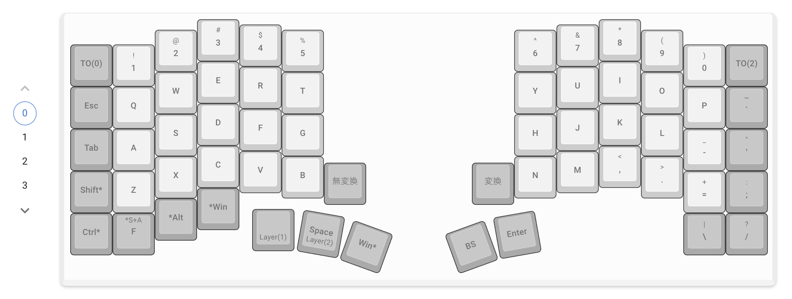
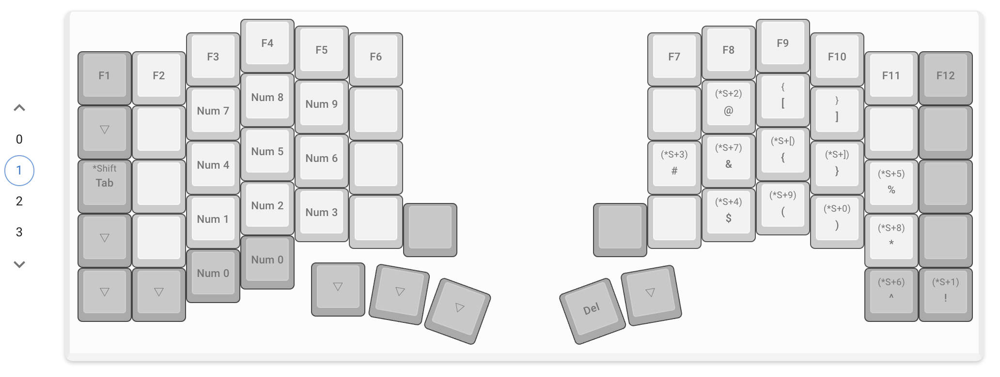
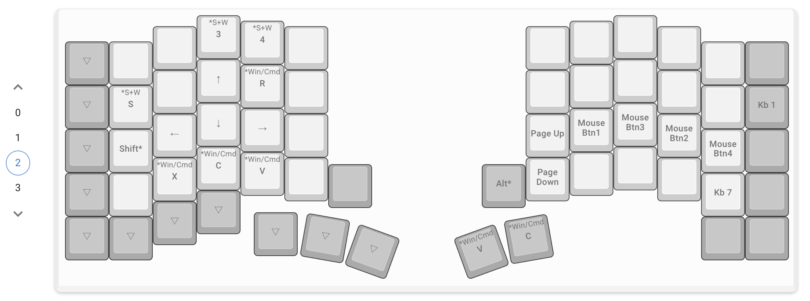
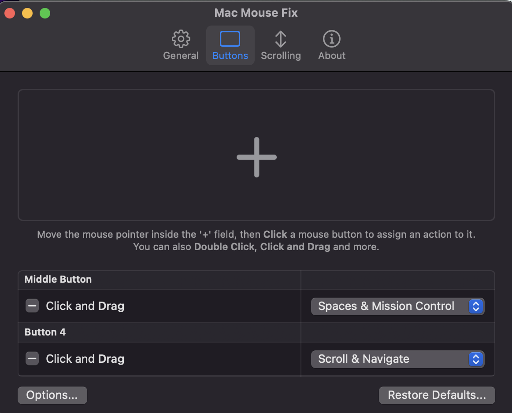

 
## そもそもなんで自作キーボードを作ろうと思ったのか
今まではあまりキーボードにこだわりがありませんでした。
構成
Windowsの場合
キーボード: [Microsoft Surface Keyboard](https://www.microsoft.com/en-US/d/surface-keyboard/8r3rqvvflp4k?activetab=pivot:overviewtab)
マウス: Logicool MX Master 3S

Mac Bookの場合
キーボード: ついているキーボード
マウス: ついているトラックパッド

というのもLogicoolのMX Master 3S やMacのトラックパッドがとても使いやすいので、キーボードまでには意識が向いていませんでした。

しかし、最近になって周りに左右分離の自作キーボード+トラックボールを使っている人が居まして、興味が湧いてきました。

## キーボード探し
その既に使っている人に聞いてみると、自作キーボードは[遊舎工房](https://yushakobo.jp/)というサイトで購入したとのことでしたので、私もこちらで購入することにしました。

そして見つけてしまったのが  [Keyball61](https://shop.yushakobo.jp/products/5358?srsltid=AfmBOor4qkhKt8gbaG_cXiqD6_kAB76rAr5xP-_E_A8WjcWyydSzQlx6)という左右分離でトラックボールが付いているキーボードです。
ちょうどこの時期に入荷していたので、運命の後押しを感じて購入することにしました。

## 作成について
私の場合は詰まったりしつつ、２日ほどで完成しました。正直しっかりと日数を分割してすっきりとした頭で作業すればよかったと後悔しています。
いろいろな方が作成記録を残しているので、それを参考に落とし穴を避けながら作することをお勧めします。**コンスルーピンには取付け方向には気をつけましょう**

動かないときは、私の場合は一度ハンダを取ってもう一度ハンダ付けをすることで解決することが多かったです。買っておいたハンダ吸い取り器と家にあった無水エタノールが大活躍しました。というかこれがないと失敗したときに取り返しがつかないので、必須アイテムだと思います。

## 使ってみて
ポテンシャルの高さを感じます。まだ使用し始めて数日で、入力するのに時間がかかりますが、キーボードから手を離さずに作業が完結できるのはとても便利です。

現在のキーマップは以下の通りです。
レイヤー0では通常のキーボードとして使えるようにしています。ただ、キー数が少ないため、一部配置を変えています。

レイヤー1では、ファンクションキーや数字キー
、記号キーを配置しています。基本的にはlayer0の拡張のイメージとして使っていて、例えばはてなキーを押すとびっくりマークが入力されるようにしています。

レイヤー2 では、マウス操作を行うためのキーを配置しています。クリック操作はもちろん、ちょっとしたカーソル移動もできるようにしています。
後述するmac-mouse-fixというツールと組み合わせて使うんでそれ用のキー配置になっています。

レイヤー3が余っているので、こちらには何かしらの機能を追加しようかと考え中です。

## 組み合わせて使っているツール

### 1. mac-mouse-fix

https://macmousefix.com/

非常に素晴らしい考えを持つツールで、
> Make Your $10 Mouse Better Than an Apple Trackpad! 

というキャッチコピー通り、ただのマウスをあのAppleのトラックパッドよりも使いやすくしてくれます。
v2とv3があり、v2は無料で使えます。ですが圧倒的にv3の方が機能が充実しているので、v3を使うことをお勧めします。有料といえど価格も2.99$とリーズナブルです。

私の場合は中指のキーとトラックボールで4本指スワイプを、小指のキーとトラックボールで2本指スワイプを設定しています。
keyballだけでもスクロールはできますが、mac-mouse-fixを使うことで360度スクロールができるようになります。これがuxを大きく向上してくれまして、スプシやfigmaなどでの作業がとても楽になりました。 
画面移動、前後のページ移動などがジェスチャーで行えることによりキーに余裕ができるので、片手だけでのブラウジング快適に行えます。

windowsの場合は、[AutoHotkey](https://www.autohotkey.com/)を使うことで同様のことができると思います。
こちらにスクリプトを公開している方がいましたので、参考にしてください。

https://github.com/YAL-Tools/ScrollBall/tree/main

### 2. Karabiner-Elements

 https://karabiner-elements.pqrs.org/

これは皆さんmacでusキーボードを使っている方は使っていると思いますが、キーマップを変更するためのツールです。
私の場合はremapだけでは対応できないキーの設定などを行うために使っています。
usキーボードとして認識されているので、remap上で無変換、変換キーを割り当てたとしても実際には使えないので、Karabiner-Elementsを使ってマッピングしています。

## 所感
自作キーボードを使い始めて数日ですが、とても楽しいです。
キーマップやキースイッチ、キーキャップなど、自分好みにカスタマイズできるのがとてもこだわりを持てて良いですし。この自作を期にキーボード周りのハードウェア、ソフトウェア、関連ツールの知識が増えました。

また、強制的に左右が分離されたのでホームポジションを意識するようになり、綺麗なタイピングができるようになってきている実感があります。入力速度はまだ落ちたままですが、これからの成長が楽しみです。

## おまけ
キースイッチ、キーキャップ探しについて

遊舎工房にて一応一式そろえたのですが、やはりいざ使ってみると他も試してみたくなるもので...

メインのキースイッチは [Tecsee Medium Switch / Tactile](https://shop.yushakobo.jp/products/7046)
親指のキースイッチは [Sunset Tactile Choc Switches](https://shop.yushakobo.jp/products/5554) → [Kailh Deep Sea Silent MINI ロープロファイルスイッチ Whale](https://talpkeyboard.net/items/66a0596a545dc7002b5dea18) 

キーキャップは [XVX Skyline R2 - Low Profile PBT Double-shot Keycap - WOB](https://shop.yushakobo.jp/products/8167) → [THT (Tai-Hao Thins) ロープロファイルキーキャップセット（PBT/MX/ミントブルー）](https://talpkeyboard.net/items/669f4c18e5f041021bcd628e)

という感じに変えたりしています。基本オフィスでも使うので、静音性を重視しています。
また、今までずっとパンタグラフキーボードを使っていたので、ロープロファイルにしています。

総ストロークが短く、タクタイル感の強く、静音性の高いものが私の好みです。
まだまだ試してみたいものがあるので、これからも楽しみです。
