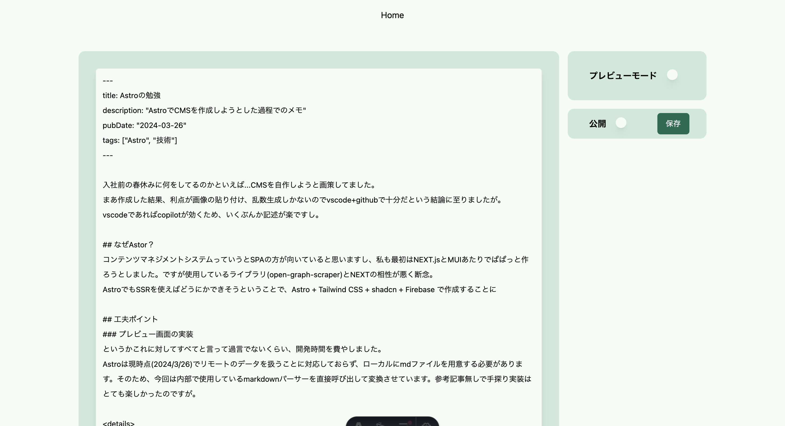
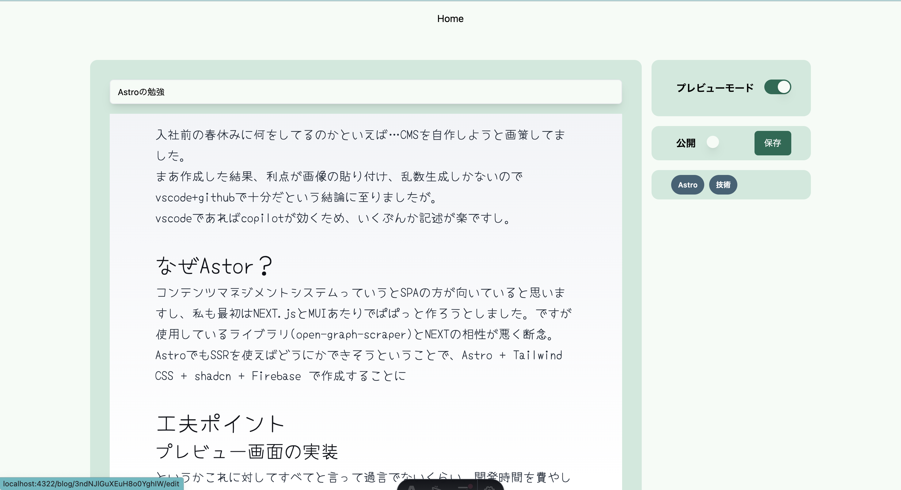

入社前の春休みに何をしてるのかといえば...CMSを自作しようと画策してました。
まあ作成した結果、利点が画像の貼り付け、乱数生成しかないのでvscode+githubで十分だという結論に至りましたが。
vscodeであればcopilotが効くため、いくぶんか記述が楽ですし。


## なぜAstor？
コンテンツマネジメントシステムっていうとSPAの方が向いていると思いますし、私も最初はNEXT.jsとMUIあたりでぱぱっと作ろうとしました。ですが使用しているライブラリ(open-graph-scraper)とNEXTの相性が悪く断念。
AstroでもSSRを使えばどうにかできそうということで、Astro + Tailwind CSS + shadcn + Firebase で作成することに

## 工夫ポイント
### プレビュー画面の実装
というかこれに対してすべてと言って過言でないくらい、開発時間を費やしました。
Astroは現時点(2024/3/26)でリモートのデータを扱うことに対応しておらず、ローカルにmdファイルを用意する必要があります。そのため、今回は内部で使用しているmarkdownパーサーを直接呼び出して変換させています。参考記事無しで手探り実装はとても楽しかったのですが。

<details>
<summary>MDXのパース処理</summary>
```typescript
import { remarkLinkCard } from "@/components/linkcard/remarkLinkCard";
import { rehypeShiki } from "@astrojs/markdown-remark";
import { compile } from "@mdx-js/mdx";
import rehypeRaw from "rehype-raw";
import rehypeStringify from "rehype-stringify";
import remarkBreaks from "remark-breaks";
import remarkFrontmatter from "remark-frontmatter";
import remarkGfm from "remark-gfm";
import remarkMdxFrontmatter from "remark-mdx-frontmatter";
import remarkSmartypants from "remark-smartypants";
import myUnifiedPluginHandlingYamlMatter from "./my-unified-plugin-handling-yaml-matter";
export default async function markdownToHtml(markdown: string): Promise<{
  content: string;
  matter: Record<string, unknown>;
}> {
  // const highlighter = await shiki.getHighlighter({ theme: "poimandres" });
  const file = await compile(markdown, {
    remarkPlugins: [
      remarkFrontmatter,
      [remarkMdxFrontmatter, { name: "matter" }],
      myUnifiedPluginHandlingYamlMatter,
      remarkGfm,
      remarkSmartypants,
      remarkBreaks,
      remarkLinkCard,
    ],
    rehypePlugins: [
      [
        rehypeRaw,
        {
          passThrough: [
            "mdxjsEsm",
            "mdxFlowExpression",
            "mdxJsxFlowElement",
            "mdxJsxTextElement",
            "mdxTextExpression",
          ],
        },
      ],
      [rehypeShiki],
      [rehypeStringify],
    ],
    outputFormat: "function-body",
  });
  return {
    content: String(file),
    matter: file.data.matter as Record<string, unknown>,
  };
}

```
</details>
<details>
<summary>クライアント側でのレンダリング</summary>
```typescript
import { runSync, type Jsx } from "@mdx-js/mdx";
import * as runtime from "react/jsx-runtime";
import LinkCard from "./linkcard/LinkCard.tsx";
export default function MDXContent({ html }: { html: string }) {
  const { default: Content } = runSync(html, {
    Fragment: runtime.Fragment,
    jsxs: runtime.jsxs as Jsx,
    jsx: runtime.jsx as Jsx,
    baseUrl: import.meta.url,
  });
  return <Content components={{ "link-card": LinkCard }} />;
}
```
</details>

上記で、実際にmdx(JSX+markdown)をHTMLに変換しています。
remarkLinkCardはリンクカードのコンポーネントを追加するためのプラグインです。これにより、mdxファイル内で`<link-card>`タグを使用することができます。


### リンクカードの作成
<details>
<summary>remarkでの処理</summary>
```typescript
export function remarkLinkCard() {
  return async (tree: Node) => {
    const tasks: Array<() => Promise<void>> = [];
    visit(tree, "paragraph", (node: ParagraphNode) => {
      if (
        node.children &&
        node.children.length === 1 &&
        node.children[0].type === "link"
      ) {
        const linkNode = node.children[0] as LinkNode;
        if (linkNode.url?.startsWith("http")) {
          const task = async () => {
            const metadata = await fetchMetadata(linkNode.url);
            const nodeData = JSON.stringify({
              ...metadata,
              url: linkNode.url,
            }).replace(/"/g, "&quot;");
            (node as unknown as LinkCardNode).type = "html";
            (
              node as unknown as LinkCardNode
            ).value = `<link-card node="${nodeData}"></link-card>`;
            (node as unknown as LinkCardNode).children = [];
          };
          tasks.push(task);
        }
      }
    });
    await Promise.all(tasks.map((task) => task()));
  };
}
```

`unist-util-visit`を使用して、Treeからリンクをlink-cardに変換しています。
</details>
既にリンクカードのライブラリを作成してくださった方がいたのですが、勉強のために今回は自作しました。

https://github.com/gladevise/remark-link-card

### View Transitionsの利用
Astroでは[View Transitions](https://developer.mozilla.org/en-US/docs/Web/API/View_Transitions_API)という、MPAでもSPAのような画面遷移を実現するAPIを使用することができます。
これを使用することで、SPAのようなUXを提供することができます。

今回の用途では、編集画面とプレビュー画面の切り替えに使用しています。

https://docs.astro.build/en/guides/view-transitions/

###  `field-sizing: content` の適用
2024年3月のアップデートでchromeに`field-sizing: content`が追加されました。これにより、`textarea`の高さを自動調整することが容易にできるようになりました。
入力フィールドが連なる場合でなければ、フィールドの高さは常にコンテンツに合わせたほうが好みです。そうすれば画面上にスクロールバーが表示されることがなくなります。

### `astro:page-load`
Astroでは、ページの読み込み時に`astro:page-load`イベントが発生します。これを使用することで、ページの読み込み時に何かしらの処理を行うことができます。
```tsx
// define:varsで変数を定義
// しかしそのままでは<script>がjsとして扱われてしまうため、windowに変数を格納している
// https://hiroppy.me/blog/astro-client-env/ こちらの記事を参考にしました
<script define:vars={{ id: blogId }}>
  window.id = id;
</script>

<script>
  document.addEventListener("astro:page-load", () => {
    const { id } = window as any;
    const textarea = document.querySelector("textarea");
    if (textarea) {
      listenPaste(id, textarea);
    }
    textarea?.addEventListener("change", (e) => {
      const content = (e.target as any).value;
      updateState({ content });
    });
  });
<script>
```
今回は、ページの読み込み時に`textarea`の`change`イベントを監視して、`content`を更新する処理を行っています。

### 画像の貼り付け機能
<details>
<summary>画像の貼り付け機能実装</summary>
```typescript
export function listenPaste(id: string, textarea: HTMLTextAreaElement) {
  textarea.addEventListener("paste", async (event) => {
    const items = event.clipboardData?.items;
    if (!items) return;

    for (const item of items) {
      if (item.type.indexOf("image") !== -1) {
        const blob = item.getAsFile();
        if (!blob) continue;

        const base64Image = await readAsDataURL(blob);
        if (typeof base64Image !== "string") continue;
        const base64Data = base64Image.split(",")[1];
        const imageUrl = await uploadImage(base64Data, id);

        // カーソル位置に画像のURLを挿入
        const startPos = textarea.selectionStart;
        const endPos = textarea.selectionEnd;
        const currentValue = textarea.value;
        const newValue =
          currentValue.substring(0, startPos) +
          `` +
          currentValue.substring(endPos);
        textarea.value = newValue;
        textarea.selectionStart = textarea.selectionEnd =
          startPos + imageUrl.length;
        // onChangeイベントを手動で発火
        const changeEvent = new Event("change", { bubbles: true });
        textarea.dispatchEvent(changeEvent);
      }
    }
  });
}
```
</details>
やはり、記事の作成において画像の貼り付け機能は欲しいですよね。というかこの画像の貼り付け機能を実装するために、このCMSを作成したと言っても過言ではないです。
今回は、画像を貼り付けると自動的にアップロードされ、URLが挿入されるようにしました。

https://code.visualstudio.com/updates/v1_79#_copy-external-media-files-into-workspace-on-drop-or-paste-for-markdown

...まあ、結局はvscodeで十分だという結論に至りましたが。ハイライトを犠牲にmdファイルとして扱えば画像の貼り付けは問題なく行えます。

まあ一応作成したCMSの方では、記事内からリンクが削除された際に、画像を削除する機能も実装しましたので、その点は勝っているかもしれません。

### 状態管理(nanostores)周り
nanostoresでフォームの状態管理を行っています。これはAstro公式で推奨されているライブラリです。依存関係が少なく、状態管理に必要な機能を提供してくれます。

今回はサーバー側でstoreを管理するようにしています。これにより、ssr時にもstoreの状態を保持することができます。
クライアントでフォームの変更を検知し、サーバーにデータを送信することで、サーバー側で状態を更新しています。

`[$store].subscribe`が便利で、mdxの内容が変更されるたびにパースしてfrontmatterにある`title`や`description`を取得できます。
<details>
<summary>storeのsubscribe</summary>
```ts
$content.subscribe(async (content) => {
  $images.set(extractImageUrls(content));
  const { matter } = markdownToHtml(content);
  $title.set((matter.title as string | undefined) ?? "");
  $description.set((matter.description as string | undefined) ?? "");
  $tags.set((matter.tags as string[] | undefined) ?? []);
});
```
</details>

私は触れたことありませんが、Remixに近いのかなと思います。